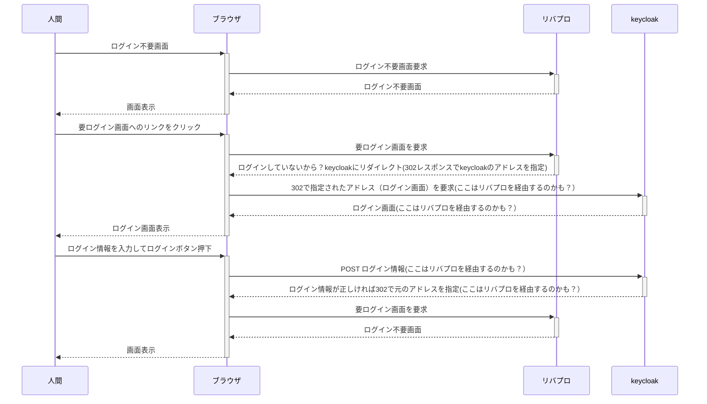

# TIL_Keycloak

[Keycloak](https://www.keycloak.org/) の基本的な使い方を把握するために試行錯誤している記録です。

規模の大きいシステムでユーザー登録等を GUI で実施するのは現実的でないように思えたので、[Keycloak](https://www.keycloak.org/) を操作する際には極力 API を使用しています。

## Keycloak の起動

[こちら](https://www.keycloak.org/getting-started/getting-started-docker)に従って [Docker](https://www.docker.com/) でやってみる。

```
docker run -p 8080:8080 -e KEYCLOAK_ADMIN=admin -e KEYCLOAK_ADMIN_PASSWORD=admin quay.io/keycloak/keycloak:18.0.2 start-dev
```

これを [Docker Compose](https://docs.docker.com/compose/) でやるなら [docker-compose.yml](https://github.com/zurustar/TIL_Keycloak/blob/main/docker-compose.yml) はこうなる

```
services:
  keycloak:
    image: quay.io/keycloak/keycloak:18.0.2
    environment:
      - KEYCLOAK_ADMIN=admin
      - KEYCLOAK_ADMIN_PASSWORD=admin
    ports:
      - "8080:8080"
    entrypoint:
      - /opt/keycloak/bin/kc.sh
      - start-dev
```

起動が完了したっぽい雰囲気になったら、起動したのと同一のマシンにてブラウザを用いて [http://localhost:8080/](http://localhost:8080/) にアクセスすると [Keycloak](https://www.keycloak.org/) の Web インタフェースを利用できる。上記コマンドをよく見るとわかるように、管理者のアカウントとパスワードは起動時に環境変数で与えていて、両方とも admin になっている。

ちなみに [Keycloak](https://www.keycloak.org/) のバージョン 17 から起動方法が変わっているので注意。これを書いている時点で唯一と思われる日本語書かれた Keycloak の書籍はバージョン 15 を使用しているので、現行バージョンとは違う起動の仕方が説明されている。

## 実験用データの環境準備

[個人情報テストデータジェネレーター](https://testdata.userlocal.jp/)を利用させていただき個人情報のダミーデータを生成して Keycloak の API を使ってユーザ登録などを実施するツールを作った。

※ちなみに同姓同名のレコードが含まれる場合がある。ユニークなキーであると想定してデータ登録すると失敗するので注意。

go の環境を準備してから(Windows や mac ならインストーラが提供されているのでかんたんに準備できるはず)、このリポジトリに含まれる [tool/main.go](https://github.com/zurustar/TIL_Keycloak/blob/main/tool/main.go) を実行する（コマンドプロンプトで tool 配下に移動して go run ./main.go、あるいは go build して生成される実行ファイルを用いても良い）。このツールはレルム一覧取得、レルム削除、レルム作成、レルムロール作成、レルムロール情報取得、グループ作成、ユーザ作成、ユーザ情報取得、ユーザのグループへの追加、ユーザへのロールの追加、クライアントの登録を実行している。詳細は[ソースコード](https://github.com/zurustar/TIL_Keycloak/blob/main/tool/main.go)を参照すること。

### API の調べ方

仕様を眺める以外に、Keycloak の GUI が Keycloak に対する REST クライアントになっているので、Keycloak を動かしているサーバで tcpdump を実行した状態で GUI で操作すると正しいリクエストを見ることができる。

## リバースプロキシの起動

SSO を実現する方法のひとつに、Web アプリの前段に [OIDC](https://openid.net/connect/) に対応したリバースプロキシを設置して、認証回りの処理は全てこいつにやらせるという方法がある。各アプリに OIDC を実装する必要がないのと、Keycloak が公式に提供している OpenID Connect 用クライアントアダプタがフロントエンドの JavaScript 向けのもの以外は廃止されている([ダウンロードページ](https://www.keycloak.org/downloads)にいくと JavaScript 以外 DEPRECATED となっている)ので、アプリで実装するのは避けたほうがいいのではないかと個人的に感じている。

[Apache](https://httpd.apache.org/)では [mod_auth_opendic](https://github.com/zmartzone/mod_auth_openidc) というモジュールがあるので、これを使ってみることにする。

このリバースプロキシに認証周りの処理を実行してほしいので、クライアントとして [Keycloak](https://www.keycloak.org/)に登録する…というのは実はこの前に実行している[ツール](https://github.com/zurustar/TIL_Keycloak/blob/main/tool/main.go)の中で実施済み。手動で実施する場合は、[Keycloak](https://www.keycloak.org/) の [管理コンソール](http://localhost:8080/) に管理者でログインして左メニューの Clients をクリックして[表示される画面](http://localhost:8080/admin/master/console/#/realms/jikken/clients)で適宜入力すればよい。

# ダミー API サーバ

[Wikipedia](https://ja.wikipedia.org/wiki)の[データ](https://dumps.wikimedia.org/jawiki)でも提供しようかと考えているが、データが巨大なのでちがう良いものがあったらそちらを使う。

※ Python で書いていたのだが m1 mac で psycopg2 が上手いこと使えず、やむをえず go に変更。あわせてデータ投入ツールも python から go に変更した。

# 以下作業中のメモ

書籍「認証と認可 Keycloak 入門」(https://www.ric.co.jp/book/new-publication/detail/2081)の6.3章をなぞりながらリバプロでのSSOを実現する実験のメモ

## 実験環境の準備

- 作業用に Windows11 が入ったパソコンを用意。アドレスは 192.168.0.云々(DHCP にしている)。
- alma linux 8 が入ったパソコン(10 年近く前にかった NUC)を用意。IP アドレスは 192.168.0.200 に固定。alma には上記の Windows パソコンから teraterm で ssh して作業。またシステムの設定変更を伴うコマンドなどは当然 root で実行している。きっと Rocky Linux でも同じ手順になるのだろう。

## 認証をかけたいアプリの準備

とりあえず Flask で適当なものを作る。きっと後で直すだろうけれど、まずはノーガードで接続できることを確認しておきたいので、さきに超単純なものを準備する。

- alma で 18080 ポートを開放した。コマンドは以下の感じ

```bash
firewall-cmd --permanent --add-port=18080/tcp
firewall-cmd --reload
```

- alma でこのアプリ関連のファイル一式をおくディレクトリを作っておく。webap という名前にした。
- このアプリで使うミドルを requirements.txt というファイルに書いて上記ディレクトリ内に配置。中身は以下のような感じ。あとで追記するかも？

```bash
flask
```

- 上記ディレクトリ内にさらに templates というディレクトリをほって、そのなかに index.html というファイルを置いておく。中身はなんでもよい
- アプリのコードを書く。後で直すかもしれないが、とりあえずは適当に以下のようにした。ファイル名は webap.py にした

```python
from flask import Flask, render_template, request
app = Flask(__name__)
@app.get("/")
def top():
  for header in request.headers:
    print(header)
  return render_template("index.html")
app.run(host="0.0.0.0", port=18080, debug=True)
```

- このスクリプトを起動

```bash
python3 ./webap.py
```

- Windows11 パソコンからhttp://192.168.0.200:18080/アクセスすると、templates/index.htmlにかいた中身がブラウザに表示され、またスクリプトを起動したコンソールには受け付けたリクエストのヘッダの情報が表示される。

## keycloak の準備

- alma で 8080 ポートを開放した。コマンドは以下の感じ

```bash
firewall-cmd --permanent --add-port=8080/tcp
firewall-cmd --reload
```

- alma で docker コマンドを実行しようとしたら podman-docker をインストールするか？と聞かれたので従った。（docker コマンドを podman コマンドに翻訳してくれるツールと思われる）
- あらためて alma で su したのち以下を実行。これで keycloak が起動してくる。管理者のアカウントとパスワードは両方とも admin。

```bash
docker run -p 8080:8080 -e KEYCLOAK_ADMIN=admin -e KEYCLOAK_ADMIN_PASSWORD=admin [quay.io/keycloak/keycloak:18.0.2](http://quay.io/keycloak/keycloak:18.0.2) start-dev
```

- keycloak に Windows パソコンからログインする。URL はhttp://192.168.0.200:8080/
- keycloak でレルムを作成する。左メニューの Master というところにマウスカーソルを合わせると「Add realm」と書いてある青いボタンが表示されるのでそれをクリックすると作成画面が表示される。この実験では demo という名前にした。
- この実験用に作ったレルム「demo」に対してクライアントを登録する。レルムとして demo が選択されていることを確認（左メニューの上部、keycloak のロゴの下に Demo と表示される）したうえで、左メニューの Clients というところをクリックするとクライアント一覧が表形式で表示され、その表の右上にある「Create」というボタンをクリックする。クライアントを追加する画面が表示されるので、Client ID のところにすきな文字列を書き、Client Protocol はデフォルトの openid-connect のままにして Save ボタンを押す。この実験では「demo_reverse_proxy」という名前にしてみた。
- 詳細設定画面が表示されるので、Access Type を confidential に変更、Valid Redirect URIs としてひとつめにhttp://192.168.0.200:18080/app/callback、ふたつめにhttp://192.168.0.200:18080/appを登録、Backchannelに[http://192.168.0.200:18080/app/callback?logout=backchannel](http://192.168.0.200:18080/app/callback?logout=backchannel) を登録する。Backchannel Logout Session Required はデフォルトで ON になっているはず。★AccessType にどんな値があってそれぞれどのような動きをするものなのかをあとで再確認する
- さらにこの client について Protocol Mapping の設定を行う。Mappers タブをクリックして表示される画面で「Create」ボタンを押し、Name を groups、Mapper Type を「Group Membership」、Token Caim Name を「groups」、Full group path を「ON」、Add to ID token を「OFF」、Add to access token を「OFF」、Add to userinfo を「ON」に設定。※ちなみにこれはグループでのアクセス制御を行う方法。
- テスト用のユーザとグループを作る。

## リバースプロキシの構築

```bash
dnf install httpd
```

mod_uth_openidc をダウンロード。以下は現時点で最新版の URL だが、github ページをみてその時の最新版を使ったほうが良いだろう。

```bash
wget https://github.com/pingidentity/mod_auth_openidc/releases/download/v2.3.0/cjose-0.5.1-1.el7.centos.x86_64.rpm
wget https://github.com/zmartzone/mod_auth_openidc/releases/download/v2.4.11.2/mod_auth_openidc-2.4.11.2-1.el8.x86_64.rpm
dnf localinstall ./cjose-0.5.1-1.el7.centos.x86_64.rpm
dnf localinstall ./mod_auth_openidc-2.4.11.2-1.el8.x86_64.rpm
```

試行錯誤しすぎてよくわからなくなっているが、、たぶん上記コマンド実行後に以下のようになったのだと思う

```bash
[root@alma8 httpd]# pwd
/etc/httpd
[root@alma8 httpd]# ls conf conf.modules.d
conf:
httpd.conf  magic

conf.modules.d:
00-base.conf  00-mpm.conf       00-systemd.conf       10-h2.conf
00-dav.conf   00-optional.conf  01-cgi.conf           10-proxy_h2.conf
00-lua.conf   00-proxy.conf     10-auth_openidc.conf  README
[root@alma8 httpd]#
```

おそらく/etc/httpd/conf/httpd.conf から/etc/httpd/conf.modules.d/\*をロードしていて、00-proxy.conf がリバースプロキシの設定、10-auth_openidc.conf が RP としての設定のはず。

、、あとは mod_auth_openidc の設定を書いていけばよいと思われる。

# こうしたい


